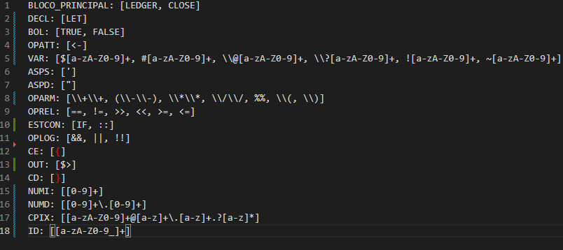

# pixscript-compiler

projeto
A partir da linguagem apresentada, deseja-se criar um analisador léxico para geração de
código tokenizado e da tabela de símbolos. A seguir as características do programa:
- O analisador léxico poderá ser escrito nas linguagens: Java; Python; Javascript; C
ou C++;
- O programa deverá receber um arquivo no formato pix. O conteúdo do arquivo é
um texto;
- O programa deverá gerar um arquivo no formato pixobj. O conteúdo do arquivo é
um texto contendo o código tokenizado;
- O programa deverá gerar um arquivo no formato csv. O conteúdo do arquivo é um
texto no formato CSV contendo a tabela de símbolos;
- Caso haja algum erro durante o processo da análise léxica, será gerado um arquivo
log contendo o erro que foi gerado.

Exemplo de um código completo escrito em PIX Script.
```
LEDGER transferencia
 LET @nome = 'Denecley Alvim'
 LET @produto = 'Placa Nvidia 5070RTX'
 LET $valor = 4999.99
 LET !pix = "soinformatica@gmail.com"
 IF (!pix != "") {
 $> 'Realizar transferência'
 }
 :: {
 $> 'Aguardando chave PIX'
 }
CLOSE
```

# 📦 Estrutura do Programa
     .
     ├── turing_machine
     │   └── edu
     │       └── src
     │           └── main
     |                └── java/ifgoiano
     |                |   ├── Analisador_Lexico.java
     |                |   ├── Leitor.java
     |                |   └── Main.java
     |                └── resources
     ├── target         ├── token_table.txt
     ├── README.md
     ├── pom.xml
     └── teste.pix
     .

# 🖥️ Diagrama de Classes

<p align="center">
 
</p>

# 📜 Etapas do Programa

1º - Criar a lista de tokens válidos.



2º - Ler todos os símbolos da tabela definidora de tokens.
<p align="center">
 
</p>

3º - Analisar caracteres do código .pix

Método ler_pix()

4º - Criar arquivo .csv da tabela de símbolos.

5º - Criar arquivo .pixobj para todos os tokens.


